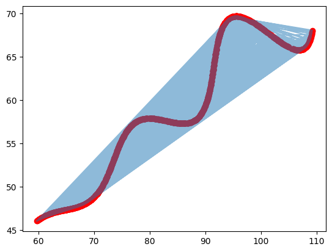

# FLAM-Assignment-for-Research-and-Development-AI

# Problem Statement:
Find the values of unknown variables in the given parametric equation of a curve :

$$x=\left(t*\cos(\theta)-e^{M\left|t\right|}\cdot\sin(0.3t)\sin(\theta)\ +X \right )$$
$$
y = \left (42 + t*\sin(\theta)+e^{M\left|t\right|}\cdot\sin(0.3t)\cos(\theta)\right)
$$
unknowns are : 
$$
\theta , M ,X
$$
Ranges :
$$
0 \deg<\theta<50 \deg \\
-0.05<M<0.05 \\
0<X<100\\
6<t<60
$$

# Apporach:
The given equation is non-linear and so linear regression was not possible.
In the given x,y dataset t was not mentioned so I assumed t to be uniformly distributed.
## Plotting The graph:
plotted the raw x,y values and a scatterplot overlayed on it.
\
From the plot itself we can calculate a rough estimate of theta.

We can see that the plot is mostly dictated by 

$$ x \approx t \cdot \cos(\theta)+X $$
$$ y \approx t \cdot \sin(\theta) +42 $$
then the other terms would dictate the curves\
we can approximately find the slope
$$ start : (60,46)$$
$$end : (108,68)$$
$$ slope =  \frac{\Delta y}{\Delta x} = \frac{y_2 - y_1}{x_2 - x_1}$$
$$m \approx \frac{22}{48} \approx 0.458 $$ 
$$m=tan(\theta)$$
$$\theta = 24.6 approx$$

## Gridsearch:
My first bruteforce/Naive approach was to gridsearch.
Its given that the L1 distance has to be minimum. Using this the initial gridsearch gave me(4.2 sec) :

$$θ = 28.0$$
$$M = 0.020000000000000004$$
$$X = 55.0$$
$$L1 =  25.244341261851268$$

Now using this result i searched nearby using a finer grid search. (2 min)

$$θ = 28.125$$
$$M = 0.021400000000000006$$
$$X = 54.9$$
$$L1 =  25.24340278201307$$

This reuslt solidified that i have exhausted gridsearch's capability.
## What i would have done next:
- I would have now moved on to local optimization (maybe using scipy).
  - Tested the different methods
- try different starting points 
  - reasoning : i from the graph i can see we have multipl local minima's so i want to see what there l1 score would be
- Maybe use a global optimizer to find the best local.

# time constraint :
- received this mail on 10/11/25 at 9:30.
- i could only manage this much in 5 hours. (form to submit : 3 pm)
